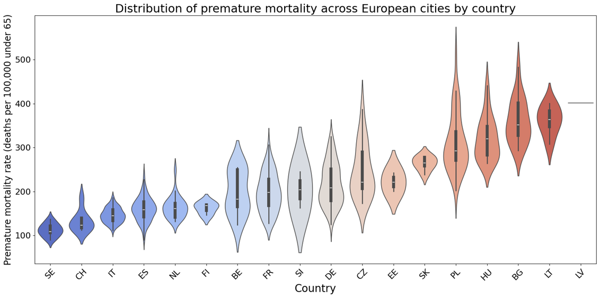
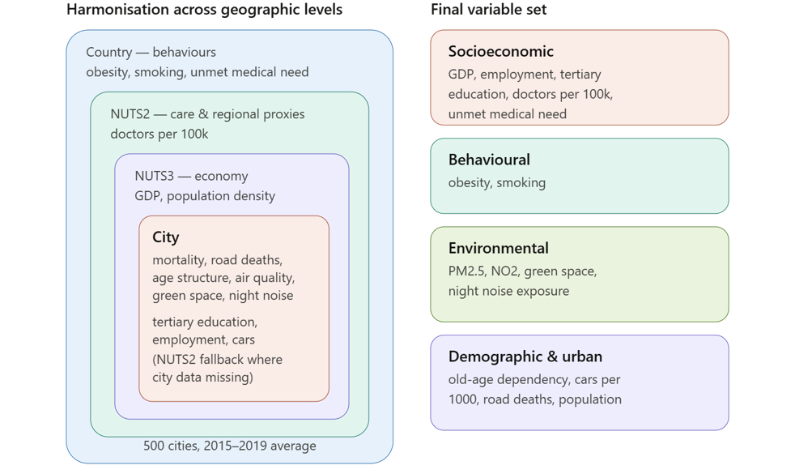
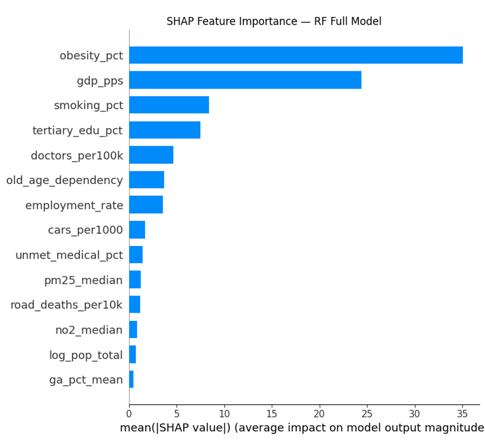
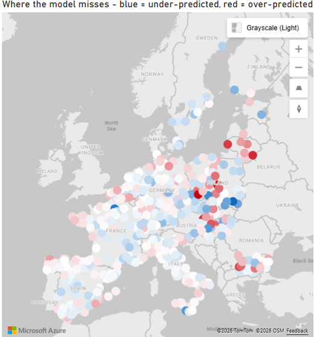

# What makes a city healthy?
### A machine learning analysis of premature mortality in European cities

## Why this project

Premature mortality, meaning deaths before age 65, varies almost fourfold across European cities: from around 90 per 100,000 in Swiss and Swedish cities to over 400 in parts of Bulgaria, Lithuania and Latvia. I wanted to understand what sits behind that gap, and in particular how environmental factors (air quality, green space, noise) compare with socioeconomic ones (income, education, healthcare, health behaviours). Put side by side, which of the two explains more of a city's health?

*Premature mortality across cities, grouped by country. The gap between countries is large, but there is also real variation between cities within the same country, which is what makes a city-level analysis worthwhile.*

## Objective

Analyse premature mortality across 500 European cities (2015–2019 average) and identify its strongest predictors, with a particular interest in how environmental factors weigh against socioeconomic ones.

## Data

Public data harmonised across four geographic levels (city, NUTS3, NUTS2, country):

- Eurostat Urban Audit, for city-level demographics, mortality, and socioeconomic indicators
- Eurostat regional databases, for GDP (PPS) and population density (NUTS3), and doctor density (NUTS2)
- Eurostat national indicators, for obesity, smoking, and unmet medical need (country level)
- European Environment Agency (END), for city-level road and rail noise exposure
- ISGlobal, for city-level air pollution (PM2.5, NO2) and green space
- ESPON, for Swiss GDP (NUTS3), which Eurostat does not cover

The ISGlobal air pollution and green space data come from two studies in *The Lancet Planetary Health*:
- Khomenko S, Cirach M, Pereira-Barboza E, et al. [Premature mortality due to air pollution in European cities: a health impact assessment](https://doi.org/10.1016/S2542-5196(20)30272-2). *Lancet Planet Health* 2021; 5: e121–e134.
- Pereira Barboza E, Cirach M, Khomenko S, et al. [Green space and mortality in European cities: a health impact assessment study](https://doi.org/10.1016/S2542-5196(21)00229-1). *Lancet Planet Health* 2021; 5: e718–e730.

*The variables used, grouped by theme and by the geographic level at which each is measured. A few are only available regionally or nationally; three city-level variables fall back to a NUTS2 rate where city data was missing.*

## Method

The pipeline starts with a linear regression, for interpretable effect sizes, then moves to a Random Forest with SHAP values to capture non-linear relationships and rank variable importance more reliably when predictors are correlated. Much of the effort went into harmonising sources that name the same city differently and report at different geographic resolutions. After modelling, the residuals, the cases where the model gets it wrong, turned out to be one of the more revealing parts of the analysis.

## What I found

The Random Forest explains about 75% of the variation in premature mortality between cities (cross-validated R² = 0.75).

The strongest predictors are socioeconomic and behavioural: obesity, smoking, GDP and education. Two of them, obesity and smoking, were only available at national level, so their effect cannot be fully separated from national context.

*Variable importance in the full model (SHAP values). Behavioural and economic factors lead; environmental variables appear lower down.*

The more revealing test was removing those national variables and refitting on the sub-national ones (city and regional). The top predictors then become GDP, doctor density, car dependency and tertiary education. Still socioeconomic, and still not environmental.

Environmental factors do matter. Air quality, green space and night noise all show protective associations pointing in the expected direction, but their weight is modest next to the socioeconomic variables. Night noise, for instance, only improved the model's performance slightly.

The residuals tell their own story. The model consistently under-predicts mortality in post-industrial Eastern European cities and over-predicts it in university cities, and Poland appears at both ends. A city's economic character, industrial versus knowledge economy, seems to matter on top of whatever country it belongs to.

*Where the model misses (residual = actual − predicted). Red cities are under-predicted: their real mortality is higher than the model expects, so the model "thinks" they are healthier than they are. These are mostly post-industrial Eastern European cities (Łódź, Vilnius, Klaipėda). Blue cities are over-predicted, healthier than the model expects, and tend to be university cities (Oulu, Zlín, Weimar). Poland appears at both ends.*

## So, what makes a city healthy?

I went in expecting environment and socioeconomics to be more of a fair fight. At this scale they were not. Even after removing the national variables, it is economy, healthcare access and education that lead, rather than air, noise or green space. On this evidence, the widest gaps between Europe's healthiest and unhealthiest cities sit on the social and economic side, which is where a closer look would most repay the effort.

## Technologies

- Python: Pandas, NumPy, scikit-learn, SHAP, Matplotlib, Seaborn
- Power BI, for the interactive dashboard and maps

## Contents

- `data_loader.ipynb`, loading and harmonising the sources
- `main.ipynb`, cleaning, exploration and modelling
- `Scripts/`, the data loader modules (`load_eurostat.py`, `load_noise.py`, `load_isglobal.py`)
- `Presentation_FR.pdf`, the final presentation (in French)
- `Cities_visualizations.pbix`, the Power BI dashboard
- `Figures/`, the figures used in this README
- `DATA/`, the raw source files

## Viewing it

There is no need to run anything: click a notebook and GitHub will display it in the browser, code, plots and all. To run it yourself, open the notebooks in Jupyter or Colab, and the dashboard in Power BI Desktop.

## Limitations and where I would take it next

This is a cross-sectional, ecological study, so none of the results are causal; they are associations. Several variables that probably matter are missing, including alcohol, diet, a city's industrial history, and inequality within a city. Some of the strongest predictors were also only available at national level.

The natural next step would be longitudinal: following cities over time and comparing those whose mortality improves with those that stagnate. That is where associations could begin to be read as effects.
